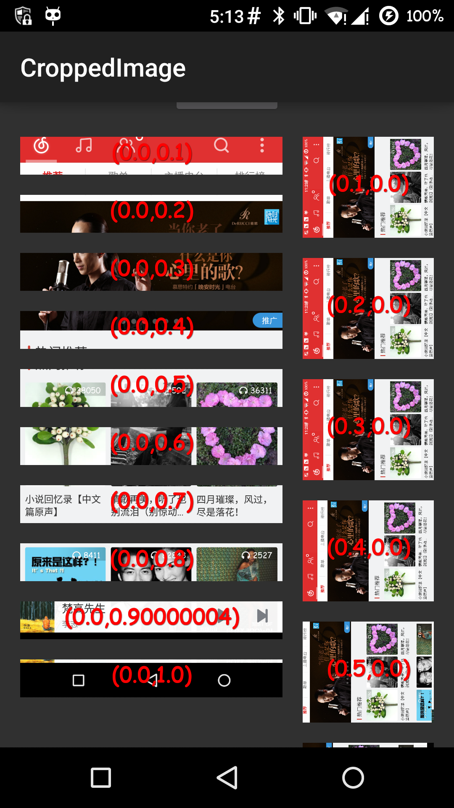
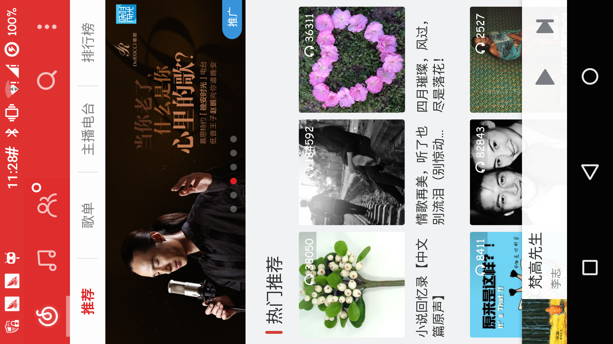

# CroppedImage
CroppedImage for any scale center


In imageview u can only setScaleType with `CENTER-CROP`, But it's shows the center `(0.5,0.5)` of the image on imageview. You can't show `(0.8f, 0.8f)` as center.

This project is animing to make any coordinate as the center.


### Usage:

In xml: 

```xml

        <me.yourbay.croppedimage.CroppedImage
            android:layout_width="match_parent"
            android:layout_height="400dp"
            android:id="@+id/iv_cropped_land_left"
            android:scaleType="matrix"
            android:layout_marginBottom="@dimen/activity_vertical_margin"/>
            
```


***make sure scaleType is `matrix`* **


```java

cv.setGravity(0.8f, 0.8f);

```


There is the screenshot:


